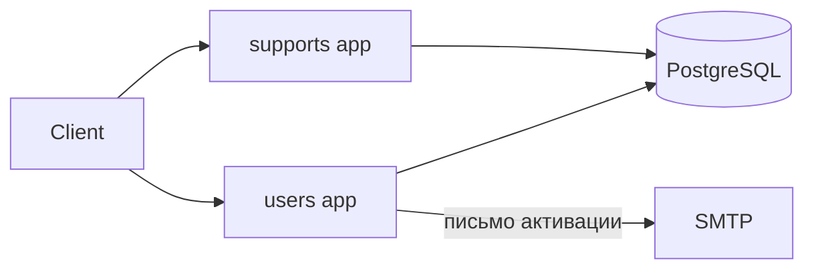
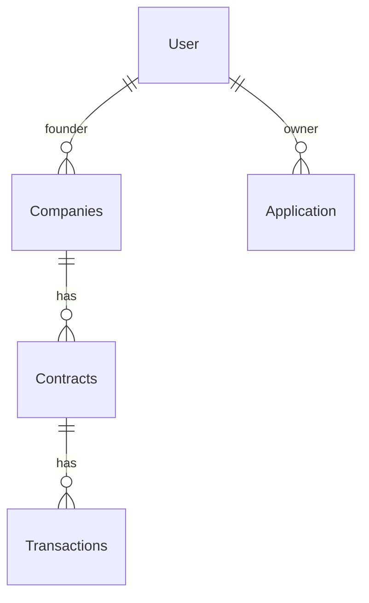
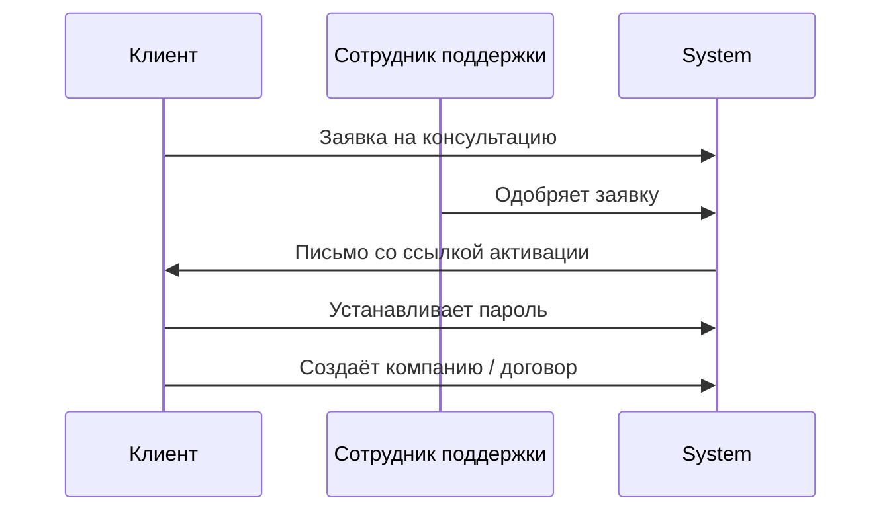

# Equiring Webapp

<!-- TODO: 1-2 предложения о продукте: для кого это, какую проблему решает.
     Пример: "Внутренний сервис для приёма и обработки заявок на подключение
     эквайринга: заявка клиента -> проверка сотрудником -> договор -> транзакции." -->

<!-- TODO: баннер/скриншот главного экрана, например:
 -->

## Стек

- Python 3.12+, Django 5.2
- PostgreSQL
- django-model-utils (`TimeStampedModel`, `SoftDeletableModel`)
- factory_boy + Faker — тестовые данные
- Docker / gunicorn — деплой

## Архитектура

<!-- TODO: диаграмма приложений/компонентов. Например, через Mermaid:


-->

Проект разбит на два Django-приложения:

| Приложение | Назначение |
|---|---|
| `users` | Кастомная модель пользователя (по `login`, без username), компании, договоры, транзакции, заявки на подключение эквайринга, личный кабинет клиента |
| `supports` | Тикеты/чат техподдержки, загрузка файлов, панель модерации (проверка заявок, компаний, договоров, тикетов сотрудниками) |

### ER-диаграмма

<!-- TODO: схема моделей и связей между ними. Можно сгенерировать через
     django-extensions (`graph_models`) или отрисовать вручную, например:


-->

### Пользовательский флоу

<!-- TODO: диаграмма основного сценария: заявка -> проверка -> активация аккаунта -> договор.


-->

## Функциональность

- Заявка на консультацию по эквайрингу без регистрации
- Одобрение/отклонение заявки сотрудником, автоматическая отправка письма со ссылкой активации аккаунта
- Личный кабинет клиента: компании, договоры, обращения в поддержку
- Панель поддержки (доступна только `is_staff`): обработка заявок, компаний, договоров, тикетов

## Установка и запуск

### Локально

```bash
git clone <repo-url>
cd Equiring-aka-webapp
python -m venv .venv
source .venv/bin/activate
pip install -r requirements.txt
cp .env.example .env   # и заполнить своими значениями
python manage.py migrate
python manage.py createsuperuser
python manage.py runserver
```

### В Docker

```bash
docker build -t equiring-webapp .
docker run --rm -p 8000:8000 --env-file .env equiring-webapp
```

База данных (PostgreSQL) в образ не входит — поднимите её отдельно и укажите
адрес в `.env` (`DB_HOST`, `DB_PORT` и т.д.), см. `.env.example`.

## Переменные окружения

Полный список — в [`.env.example`](.env.example). Основные:

| Переменная | Назначение |
|---|---|
| `SECRET_KEY` | секретный ключ Django |
| `DEBUG` | режим отладки (`True`/`False`) |
| `ALLOWED_HOSTS` | список хостов через запятую |
| `DB_NAME`, `DB_USER`, `DB_PASSWORD`, `DB_HOST`, `DB_PORT` | подключение к PostgreSQL |
| `SITE_URL` | базовый URL для ссылок в письмах |
| `DEFAULT_FROM_EMAIL`, `EMAIL_BACKEND` | отправка почты |

## Тесты

```bash
python manage.py test
```

<!-- TODO: если настроите CI (GitHub Actions) — добавить сюда бейдж:
[](...) -->

## Структура проекта

```
webapp/     — настройки проекта, роутинг
users/      — пользователи, компании, договоры, транзакции, заявки
supports/   — тикеты поддержки, файлы, панель модерации
tests/      — фабрики и тесты (factory_boy)
templates/  — общие шаблоны
static/     — статические файлы
```

## Roadmap

- [ ] Разграничение прав через `Permission`/группы вместо одного флага `is_staff`
- [ ] CI (GitHub Actions): тесты + линтер
- [ ] Docker Compose для локального поднятия PostgreSQL
- [ ] Тестовое покрытие приложения `users`
