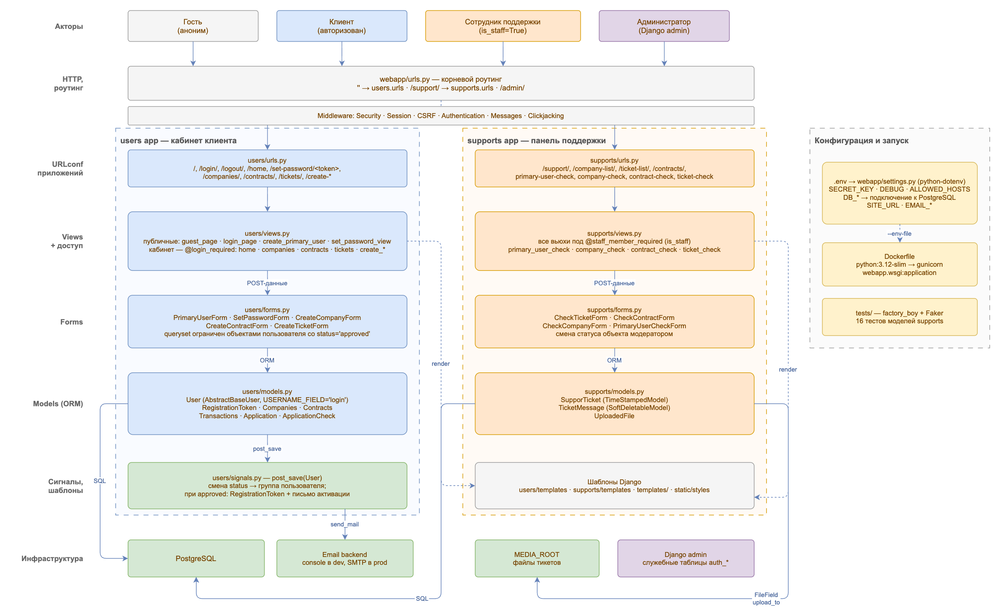
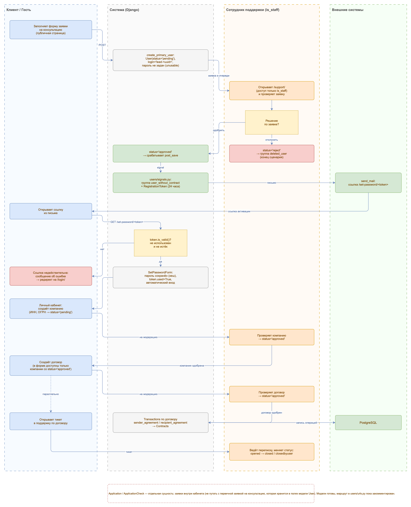

# Equiring Webapp

> **Учебный проект.** Написан для практики и не предназначен для использования
> в продакшене: часть сценариев реализована частично, полноценной интеграции
> с платёжным провайдером нет.

Веб-сервис для приёма и обработки заявок на подключение эквайринга: клиент
оставляет заявку на консультацию → сотрудник поддержки её проверяет → клиент
получает письмо со ссылкой активации и заводит аккаунт → добавляет компанию и
договор (каждый проходит модерацию) → по договору проходят транзакции, а вопросы
решаются через тикеты техподдержки.

<!-- TODO: скриншот главного экрана:
 -->

## Стек

- Python 3.12+, Django 5.2
- PostgreSQL
- django-model-utils (`TimeStampedModel`, `SoftDeletableModel`)
- factory_boy + Faker — тестовые данные
- Docker / gunicorn — деплой

## Архитектура

Проект разбит на два Django-приложения:

| Приложение | Назначение |
|---|---|
| `users` | Кастомная модель пользователя (по `login`, без username), компании, договоры, транзакции, заявки на подключение эквайринга, личный кабинет клиента |
| `supports` | Тикеты/чат техподдержки, загрузка файлов, панель модерации (проверка заявок, компаний, договоров, тикетов сотрудниками) |

Слои приложения — от акторов и роутинга до моделей и инфраструктуры, с границами
обоих приложений и точками контроля доступа (`@login_required` в кабинете,
`@staff_member_required` в панели поддержки):



### Бизнес-флоу

Основной сценарий по дорожкам участников — от заявки на консультацию до
транзакций и тикетов:



### ER-диаграмма

13 таблиц, 19 связей. Служебные таблицы Django (`auth_group`, `auth_permission`,
`django_session` и M2M к ним) в схему не включены.

Схема БД ведётся в [drawDB](https://drawdb.app):
[`docs/db-schema.drawdb.json`](docs/db-schema.drawdb.json) (`File → Import diagram`).

### Исходники схем

Схемы редактируются в [draw.io](https://app.diagrams.net) (`File → Open`),
картинки выше — экспорт из них:

| Исходник | Экспорт |
|---|---|
| [`docs/architecture.drawio`](docs/architecture.drawio) | [PNG](docs/images/architecture.png) · [SVG](docs/images/architecture.svg) |
| [`docs/business-flow.drawio`](docs/business-flow.drawio) | [PNG](docs/images/business-flow.png) · [SVG](docs/images/business-flow.svg) |
| [`docs/db-schema.drawdb.json`](docs/db-schema.drawdb.json) | — (формат drawDB) |

## Функциональность

- Заявка на консультацию по эквайрингу без регистрации
- Одобрение/отклонение заявки сотрудником, автоматическая отправка письма со ссылкой активации аккаунта
- Активация аккаунта по одноразовому токену со сроком жизни 24 часа
- Личный кабинет клиента: компании, договоры, обращения в поддержку
- Панель поддержки (доступна только `is_staff`): обработка заявок, компаний, договоров, тикетов

## Установка и запуск

### Локально

```bash
git clone <repo-url>
cd Equiring-aka-webapp
python -m venv .venv
source .venv/bin/activate
pip install -r requirements.txt
cp .env.example .env   # и заполнить своими значениями
python manage.py migrate
python manage.py createsuperuser
python manage.py runserver
```

### В Docker

```bash
docker build -t equiring-webapp .
docker run --rm -p 8000:8000 --env-file .env equiring-webapp
```

База данных (PostgreSQL) в образ не входит — поднимите её отдельно и укажите
адрес в `.env` (`DB_HOST`, `DB_PORT` и т.д.), см. `.env.example`.

## Переменные окружения

Полный список — в [`.env.example`](.env.example). Основные:

| Переменная | Назначение |
|---|---|
| `SECRET_KEY` | секретный ключ Django |
| `DEBUG` | режим отладки (`True`/`False`) |
| `ALLOWED_HOSTS` | список хостов через запятую |
| `DB_NAME`, `DB_USER`, `DB_PASSWORD`, `DB_HOST`, `DB_PORT` | подключение к PostgreSQL |
| `SITE_URL` | базовый URL для ссылок в письмах |
| `DEFAULT_FROM_EMAIL`, `EMAIL_BACKEND` | отправка почты |

## Тесты

```bash
python manage.py test
```

<!-- TODO: если настроите CI (GitHub Actions) — добавить сюда бейдж:
[](...) -->

## Структура проекта

```
webapp/     — настройки проекта, роутинг
users/      — пользователи, компании, договоры, транзакции, заявки
supports/   — тикеты поддержки, файлы, панель модерации
tests/      — фабрики и тесты (factory_boy)
templates/  — общие шаблоны
static/     — статические файлы
docs/       — схемы архитектуры, бизнес-флоу и БД
```

## Команда

| Участник | Зона ответственности |
|---|---|
| [@larigoris](https://github.com/larigoris) | Бэкенд: архитектура серверной части, проектирование и разработка базы данных, модели и бизнес-логика, юнит-тесты |
| [@APMeist](https://github.com/APMeist) | Фронтенд |

## Roadmap

- [ ] Разграничение прав через `Permission`/группы вместо одного флага `is_staff`
- [ ] CI (GitHub Actions): тесты + линтер
- [ ] Docker Compose для локального поднятия PostgreSQL
- [ ] Тестовое покрытие приложения `users`
