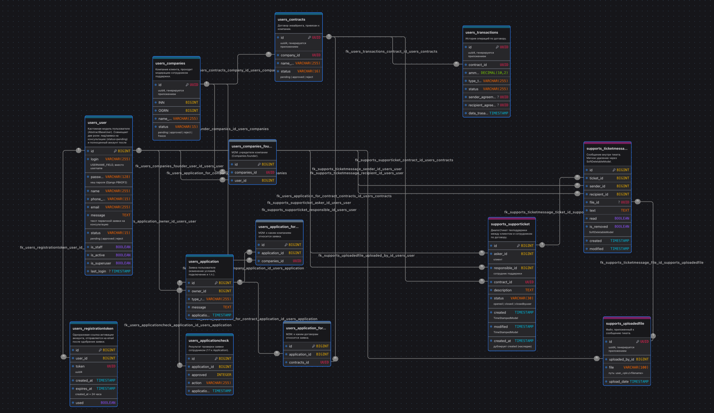

# Equiring Webapp

> **Учебный проект.** Написан для практики и не предназначен для использования
> в продакшене: часть сценариев реализована частично, полноценной интеграции
> с платёжным провайдером нет.

Веб-сервис для приёма и обработки заявок на подключение эквайринга: клиент
оставляет заявку на консультацию → сотрудник поддержки её проверяет → клиент
получает письмо со ссылкой активации и заводит аккаунт → добавляет компанию и
договор (каждый проходит модерацию) → по договору проходят транзакции, а вопросы
решаются через тикеты техподдержки.

## Стек

- Python 3.12+, Django 5.2
- PostgreSQL
- django-model-utils (`TimeStampedModel`, `SoftDeletableModel`)
- factory_boy + Faker — тестовые данные
- Docker / gunicorn — деплой

## Архитектура

Проект разбит на два Django-приложения:

| Приложение | Назначение |
|---|---|
| `users` | Кастомная модель пользователя (по `login`, без username), компании, договоры, транзакции, заявки на подключение эквайринга, личный кабинет клиента |
| `supports` | Тикеты/чат техподдержки, загрузка файлов, панель модерации (проверка заявок, компаний, договоров, тикетов сотрудниками) |

Слои приложения — от акторов и роутинга до моделей и инфраструктуры, с границами
обоих приложений и точками контроля доступа (`@login_required` в кабинете,
`@staff_member_required` в панели поддержки):


### Бизнес-флоу

Основной сценарий по дорожкам участников — от заявки на консультацию до
транзакций и тикетов:


### ER-диаграмма

13 таблиц, 19 связей. Служебные таблицы Django (`auth_group`, `auth_permission`,
`django_session` и M2M к ним) в схему не включены.



Схема БД ведётся в [drawDB](https://drawdb.app):
[`docs/db-schema.drawdb.json`](docs/db-schema.drawdb.json) (`File → Import diagram`).

### Исходники схем

Архитектура и бизнес-флоу редактируются в [draw.io](https://app.diagrams.net)
(`File → Open`), ER-диаграмма — в [drawDB](https://drawdb.app)
(`File → Import diagram`); картинки выше — экспорт из них:

| Исходник | Экспорт |
|---|---|
| [`docs/architecture.drawio`](docs/architecture.drawio) | [PNG](docs/images/architecture.png) · [SVG](docs/images/architecture.svg) |
| [`docs/business-flow.drawio`](docs/business-flow.drawio) | [PNG](docs/images/business-flow.png) · [SVG](docs/images/business-flow.svg) |
| [`docs/db-schema.drawdb.json`](docs/db-schema.drawdb.json) | [PNG](docs/images/db-schema.png) |

## Функциональность

- Заявка на консультацию по эквайрингу без регистрации
- Одобрение/отклонение заявки сотрудником, автоматическая отправка письма со ссылкой активации аккаунта
- Активация аккаунта по одноразовому токену со сроком жизни 24 часа
- Личный кабинет клиента: компании, договоры, обращения в поддержку
- Панель поддержки (доступна только `is_staff`): обработка заявок, компаний, договоров, тикетов

### Известные ограничения

Проект учебный и доведён не до конца — что именно не работает:

- Часть страниц панели поддержки и страница установки пароля отдают ошибку:
  вьюхи ссылаются на шаблоны и имена маршрутов, которых нет
  (`supports/company-list.html`, `supports/ticket-list.html`,
  `supports/contract-list.html`, `users/set_password.html`, маршрут
  `updateticketform`). Бэкенд и вёрстка разошлись в именах.
- Заявки внутри кабинета (`Application` / `ApplicationCheck`) существуют на
  уровне моделей, но маршрут в `users/urls.py` закомментирован.
- У `Transactions.sender_agreement` / `recipient_agreement` по замыслу должны
  быть внешние ключи на `Contracts`, но на уровне БД это обычные UUID.
- Списки на страницах кабинета пока не наполняются данными из БД — вьюхи
  рендерят шаблоны без контекста.

## Установка и запуск

### Требования

- Python 3.12+ (разработка велась на 3.14)
- PostgreSQL 14+ (разработка велась на 18)

### Локально

```bash
git clone <repo-url>
cd Equiring-aka-webapp
python -m venv .venv
source .venv/bin/activate
pip install -r requirements.txt
cp .env.example .env   # и заполнить своими значениями
```

Создайте базу, имя которой указали в `.env` (по умолчанию `postgres`), например:

```bash
createdb -h 127.0.0.1 -U postgres postgres
```

Затем примените миграции и запустите сервер:

```bash
python manage.py migrate
python manage.py createsuperuser
python manage.py runserver
```

### В Docker

```bash
docker build -t equiring-webapp .
docker run --rm -p 8000:8000 --env-file .env equiring-webapp
```

База данных в образ не входит — поднимите PostgreSQL отдельно и укажите адрес
в `.env`. Учтите, что `DB_HOST=127.0.0.1` внутри контейнера указывает на сам
контейнер, а не на хост: для базы, поднятой на хосте, используйте
`DB_HOST=host.docker.internal` (macOS, Windows) или запуск с `--network host`
(Linux).

## Переменные окружения

Полный список — в [`.env.example`](.env.example). Основные:

| Переменная | Назначение |
|---|---|
| `SECRET_KEY` | секретный ключ Django |
| `DEBUG` | режим отладки (`True`/`False`) |
| `ALLOWED_HOSTS` | список хостов через запятую |
| `DB_NAME`, `DB_USER`, `DB_PASSWORD`, `DB_HOST`, `DB_PORT` | подключение к PostgreSQL |
| `SITE_URL` | базовый URL для ссылок в письмах |
| `DEFAULT_FROM_EMAIL`, `EMAIL_BACKEND` | отправка почты |

## Тесты

16 тестов на модели приложения `supports`, данные готовятся фабриками
factory_boy (`tests/factories.py`):

```bash
python manage.py test
```

Тестам нужен работающий PostgreSQL: Django создаёт отдельную базу
`test_<DB_NAME>`, поэтому у пользователя из `.env` должно быть право `CREATEDB`.

## Что посмотреть в коде

Короткая навигация для ревью:

| Где | Что интересного |
|---|---|
| [`users/models.py`](users/models.py) | Кастомная модель пользователя на `AbstractBaseUser` с `USERNAME_FIELD = 'login'` и собственным менеджером |
| [`users/signals.py`](users/signals.py) | Активация аккаунта: по смене статуса на `approved` сигнал `post_save` заводит группу, одноразовый `RegistrationToken` на 24 часа и шлёт письмо |
| [`users/forms.py`](users/forms.py) | Формы сужают `queryset` до объектов текущего пользователя со статусом `approved` — чтобы нельзя было привязаться к чужой компании |
| [`supports/views.py`](supports/views.py) | Панель модерации целиком под `@staff_member_required` |
| [`supports/models.py`](supports/models.py) | `TimeStampedModel` / `SoftDeletableModel`, работа с диалогами через статические методы |
| [`tests/`](tests/) | Фабрики factory_boy и тесты моделей |

## Структура проекта

```
webapp/     — настройки проекта, роутинг
users/      — пользователи, компании, договоры, транзакции, заявки
supports/   — тикеты поддержки, файлы, панель модерации
tests/      — фабрики и тесты (factory_boy)
templates/  — общие шаблоны
static/     — статические файлы
docs/       — схемы архитектуры, бизнес-флоу и БД
```

## Команда

| Участник | Зона ответственности |
|---|---|
| [@larigoris](https://github.com/larigoris) | Бэкенд: архитектура серверной части, проектирование и разработка базы данных, модели и бизнес-логика, юнит-тесты |
| [@APMeist](https://github.com/APMeist) | Фронтенд |

## Roadmap

- [ ] Согласовать имена шаблонов и маршрутов между бэкендом и вёрсткой — чтобы
      панель поддержки и страница установки пароля перестали падать
- [ ] Наполнить страницы-списки данными (передавать queryset в контекст)
- [ ] Подключить маршруты для `Application` / `ApplicationCheck`
- [ ] Внешние ключи для `Transactions.sender_agreement` / `recipient_agreement`
- [ ] Разграничение прав через `Permission`/группы вместо одного флага `is_staff`
- [ ] Тестовое покрытие приложения `users`
- [ ] CI (GitHub Actions): тесты + линтер
- [ ] Docker Compose для локального поднятия PostgreSQL
- [ ] Скриншоты интерфейса в README
